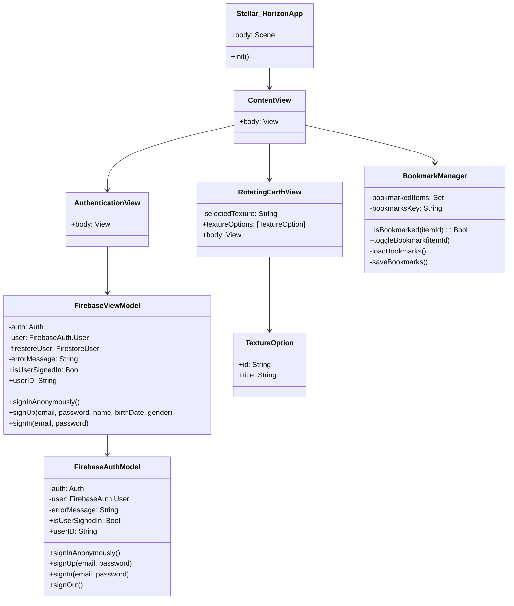

# Stellar Horizon 🌌

**Explore the Cosmos from Your Pocket**  
Stellar Horizon is an immersive iOS app that brings the wonders of space to your fingertips. Discover stunning astrophotography, stay updated with the latest space news, track the ISS in real-time, and visualize Earth's climate changes through an interactive 3D globe.

---

## Features 🚀

### 🌠 Astro Photos 
- Browse breathtaking space images from **NASA**, **ESA**, and other sources.
- **Save favorites** to your Firebase Firestore account for offline access.
- Seamless authentication via **Firebase** (anonymous, email, or Google Sign-In).

### 📰 Space News 
- Read curated articles from **NASA** and **ESA** directly in-app using **WebKit**.
- **Bookmark links** to revisit later (stored in Firestore).

### 🛰️ ISS Tracker 
- Real-time tracking of the International Space Station on a **MapKit**-powered map.
- View the ISS's current location, speed, and orbital path.

### 🌍 3D Climate Globe 
- A **SceneKit**-rendered 3D Earth model showcasing historical climate data.
- Adjust timelines to see **temperature changes** visualized through dynamic textures.

---

## UML Diagram 📊
Below is a placeholder for the UML diagram of the app's architecture. This diagram will provide an overview of the classes, relationships, and interactions within the project.



---

## Installation ⚙️

1. **Clone the Repository**  
   ```bash
   git clone https://github.com/your-username/stellar-horizon.git
   cd stellar-horizon
   ```

2. **Install Package Dependencies**  

3. **Open in Xcode**  
   Launch `Stellar Horizon.xcworkspace`.

---

## Configuration 🔑

### Firebase Setup 🔥
1. Create a Firebase project on the [Firebase Console](https://console.firebase.google.com/).
2. Enable **Authentication** (Anonymous, Email/Password, Google Sign-In).
3. Enable **Firestore Database**.
4. Download your `GoogleService-Info.plist` and add it to the Xcode project under the `Stellar Horizon` target.

### NASA API Key 🛸
1. Obtain a free API key from [NASA API Portal](https://api.nasa.gov/).
2. Add the key to `Config.swift`:
   ```swift
   struct Config {
       static let nasaAPIKey = "YOUR_API_KEY_HERE"
   }
   ```

---

## Technologies Used 💻
- **Authentication & Database**: Firebase (Auth, Firestore)
- **APIs**: NASA APOD (Astronomy Picture of the Day), NASA/ESA News
- **Mapping**: MapKit (ISS Tracker)
- **3D Rendering**: SceneKit (Climate Globe)
- **Web Content**: WebKit (Space News)
- **RSS Feeds**: FeedKit
- **Lottie Animations**: Airbnb Lottie Framework

---

## License 📄
Distributed under the MIT License. See `LICENSE` for details.

---

## Acknowledgments 🪐
- **NASA** and **ESA** for providing open-access APIs and media.
- Firebase for backend infrastructure.
- The open-source community for invaluable tools and libraries.

  
